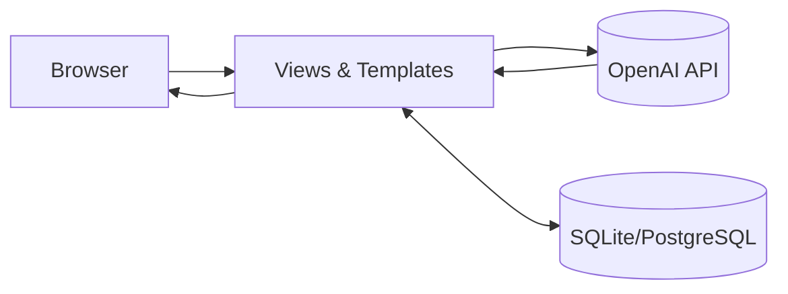

# LLM‑RAG‑Practice

LLM 기반 실습 저장소입니다. OpenAI API를 이용한 간단한 CLI 챗, Django 웹앱(회원/게시글/챗봇), Hugging Face Transformers로 로컬 LLM 실행 예제를 포함합니다. 현재 코드는 **RAG 준비 단계**(프롬프트·웹앱·로컬 모델 실험)까지 구현되어 있습니다. 이후 벡터DB·임베딩·리트리버를 연계하는 RAG 모듈을 추가할 수 있도록 구조를 정리했습니다.

---

## 폴더 구성

```
LLM-RAG-Practice/
├─ LLM_practice01/        # OpenAI ChatCompletion 기반 CLI 챗봇(대화 로그 파일 저장)
│  ├─ main/               # main.py, text.txt
│  ├─ README.md           # Transformer/Cloud 소개 문서
│  └─ requirements.txt    # openai==0.28.0, python-dotenv 등
│
├─ LLM_practice02/        # Django 4.2 웹앱(계정·게시판·챗봇)
│  ├─ gpt_project01/      # Django 프로젝트 설정
│  ├─ accounts/           # 사용자 모델/회원가입·로그인
│  ├─ posts/              # 게시글 CRUD, 댓글, 좋아요
│  ├─ chatbot/            # 로그인 필요 챗봇 화면(OpenAI 연동)
│  ├─ templates/          # base.html, 페이지 템플릿
│  ├─ manage.py
│  └─ requirements.txt    # Django, openai, python-dotenv 등
│
└─ LLM_practice03/        # Transformers 기반 로컬 LLM 실행(메타 Llama2 예제)
   ├─ main/               # main01~05.py (device_map, 오프로딩, 토큰 사용 예)
   ├─ README.md
   └─ requirements.txt    # transformers==4.48.x, torch==2.5.x 등
```

---

## 빠른 시작

### 공통 준비물

* Python 3.10 이상(권장 3.12)
* 가상환경 사용 권장(`python -m venv .venv && source .venv/bin/activate` 또는 Windows는 `.venv\Scripts\activate`)

> 각 폴더별로 **독립 가상환경**을 만드는 것을 추천합니다. 라이브러리 버전(예: torch/transformers) 차이가 큽니다.

---

## 1) LLM\_practice01 — CLI 챗봇(OpenAI)

간단한 시스템 프롬프트로 대화를 시작하고, 입출력을 `main/text.txt`에 누적 저장합니다.

### 설치

```bash
cd LLM_practice01
python -m venv .venv && source .venv/bin/activate    # Windows: .venv\Scripts\activate
pip install -r requirements.txt
```

### 환경 변수(.env)

```
OPENAI_API_KEY=sk-...
```

### 실행

```bash
python main/main.py
```

* 시스템 프롬프트: `너는 영어 선생님이야. user의 영어 공부를 도와줘.`
* 대화 로그: `main/text.txt`에 `USER/AI` 라인으로 저장

> 현재 코드는 `openai==0.28.0`의 `ChatCompletion` 엔드포인트를 사용합니다. 최신 OpenAI SDK를 사용할 경우 API 인터페이스가 달라질 수 있으니 주의하세요.

---

## 2) LLM\_practice02 — Django 웹앱

회원가입/로그인, 게시글 CRUD(댓글·좋아요 포함), **로그인 사용자용 챗봇**을 제공합니다. 챗봇은 OpenAI API를 호출해 **동기 부여 명언** 중심의 응답을 생성합니다.

### 의존성

* Django==4.2
* openai==0.28.0
* python-dotenv 등 (모두 `requirements.txt` 참고)

### 설치·실행

```bash
cd LLM_practice02
python -m venv .venv && source .venv/bin/activate    # Windows: .venv\Scripts\activate
pip install -r requirements.txt

# 환경 변수 파일 생성
cat > .env << 'EOF'
OPENAI_API_KEY=sk-...
EOF

# 마이그레이션 및 관리자 계정
python manage.py migrate
python manage.py createsuperuser

# 서버 실행
python manage.py runserver 0.0.0.0:8000
```

### 주요 URL

* 홈: `/` (core.index)
* 회원: `/accounts/signup`, `/accounts/login`, `/accounts/logout`
* 게시글: `/posts/post-list`, `/posts/post-create`, `/posts/post-detail/<pk>`, `/posts/post-update/<pk>`, `/posts/post-delete/<pk>`
* 좋아요: `/posts/post-like/<pk>`
* 챗봇: `/chatbot/` (로그인 필요)

### 챗봇 동작 요약

* 시스템 프롬프트(고정): `내가 하는 말이랑 최대한 연관지어서 오늘 하루 힘낼 수 있는 명언해줘`
* 입력: 사용자가 폼에 입력한 `user_input`
* 호출: `openai.ChatCompletion.create(model="gpt-3.5-turbo", messages=[...])`
* 저장: `ChatMessage` 모델에 `user_text`와 `bot_response` 기록

### 데이터 모델 개요

* `accounts.User`: `AbstractUser` 상속
* `posts.Post`: 제목/내용/작성자(+ 좋아요 관계) 및 타임스탬프
* `posts.Comment`: 댓글(작성자, 본문, 타임스탬프)
* `chatbot.ChatMessage`: 사용자 입력·응답·작성자·시간

> 템플릿에 `post.likes` 토글 로직이 포함되어 있으며, 마이그레이션에 맞춰 모델에 좋아요(ManyToMany) 필드가 정의되어 있습니다.

### 간단 아키텍처



### 개발 팁

* `base.html`의 네비게이션 링크로 주요 페이지 이동
* `LoginRequiredMixin`으로 챗봇 보호
* 운영 배포 시 `SECRET_KEY`, DB, 정적 파일, CSRF/보안 헤더 설정 필요

---

## 3) LLM\_practice03 — Transformers 로컬 LLM

`meta-llama/Llama-2-7b-chat-hf` 모델을 예제로 사용합니다. CPU만으로는 매우 느릴 수 있으므로, GPU 또는 `device_map="auto"` 오프로딩 옵션을 활성화합니다.

### 설치

```bash
cd LLM_practice03
python -m venv .venv && source .venv/bin/activate    # Windows: .venv\Scripts\activate
pip install -r requirements.txt
```

### Hugging Face 토큰 설정(.env)

```
HUGGINGFACE_TOKEN=hf_...
```

> Llama 2 가중치는 허브 이용약관 동의 및 접근 권한이 필요합니다. 토큰은 개인 계정의 액세스 토큰을 사용하세요.

### 실행 예

```bash
python main/main01.py     # 기본 로딩
python main/main02.py     # device_map="auto" 예제 (오프로딩)
python main/main03.py     # 동일 + 실행시간 출력
python main/main04.py     # 토큰 사용 및 간단 번역 포맷
```

### 코드 스니펫(개념)

```python
from transformers import AutoTokenizer, AutoModelForCausalLM

tokenizer = AutoTokenizer.from_pretrained("meta-llama/Llama-2-7b-chat-hf")
model = AutoModelForCausalLM.from_pretrained(
    "meta-llama/Llama-2-7b-chat-hf",
    device_map="auto",
    offload_folder="offload",
    offload_state_dict=True,
)
```

---

## RAG로 확장하는 방법(로드맵)

1. **문서 적재 파이프라인**: PDF/웹페이지/마크다운 → 청크 분할 → 임베딩 생성(OpenAI, `text-embedding-3-large` 등 또는 로컬 임베딩)
2. **벡터 DB**: FAISS/Chroma/pgvector 중 택1
3. **검색 체인**: 쿼리 확장 → 상위 k문서 검색 → 컨텍스트 구성 → LLM에 프롬프트로 전달
4. **평가**: 문서 적중률, 답변 충실도/사실성 측정(RAGAS 등)
5. **웹앱 통합**: LLM\_practice02에 리트리버 삽입, 소스 하이라이트/참조 반환

> 초기에는 **Chroma + OpenAI 임베딩**이 진입 장벽이 낮습니다. 이후 비용·보안을 고려해 로컬 임베딩/pgvector로 전환할 수 있습니다.

---

## 환경 변수 요약

```ini
# 공통(OpenAI)
OPENAI_API_KEY=sk-...

# transformers/HF 허브(LLM_practice03)
HUGGINGFACE_TOKEN=hf-...
```

## 자주 겪는 문제 해결

* OpenAI 라이브러리 버전이 다르면 `ChatCompletion` 호출이 실패할 수 있습니다. `requirements.txt` 버전을 맞추거나, 최신 SDK에 맞게 호출 코드를 수정하세요.
* Llama 2 모델 로드는 **수십 GB 메모리**를 요구할 수 있습니다. GPU 메모리 부족 시 `device_map="auto"`, `offload_folder` 사용 또는 더 작은 모델로 교체하세요.
* Django 개발 서버에서 템플릿/정적 파일이 갱신되지 않으면 브라우저 캐시를 비우거나 서버를 재시작하세요.
